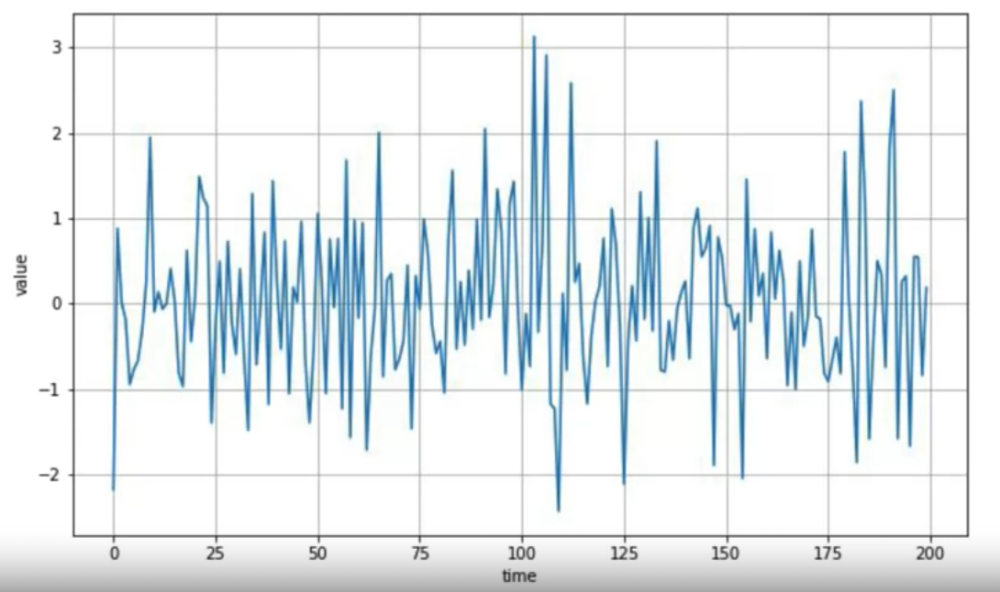

# Sequences , Time Series 

## What is the timeseries 

### Example of Multivariate Time Series 
 

 

### Another Example of multi Variate time Series 

 

 A multi-variate time series chart can be a helpful way to understanding the impact of related data.

 
 Chart displaying birth vs. death in Japan .

 

 
  Also consider this chart showing the global temperature against CO2 concentration

 

## Machine learning applied to time series

- Prediction of forecasting based on the data 
- Project back into the past ( Imputation ) to see how we get where we are now 

**with Imputation, we can fill the missing data in the timeframe**

## Common patterns in time series

 

### `Trends`, where the time series have a specific direction to move

 
 

### `Seasonality`, which is seen when patterns repeat at predictable intervals

 
 
 

###  Some time series can have a combination of both trend and seasonality as this chart shows

 
 
 

###  some that are probably not predictable at all and just a complete set of random values 

 
 
 

### Introduction to time series 

